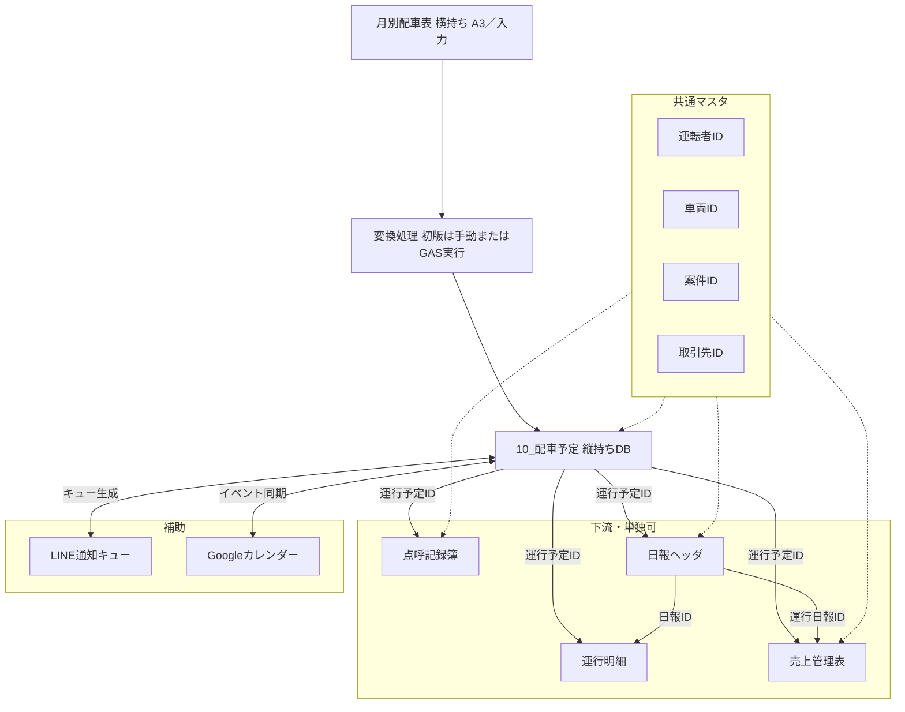

# 運行システム2 — システム全体設計

## 1. 結論（設計の要）

- **データの起点（システム連携）**は **`10_配車予定`**（月別の印刷用・横持ち配車表から変換した**縦持ちDB**。詳細は下記「二層構造」）。付与される **運行予定ID（内部Key: UNIQUEID）** を点呼・日報・売上・カレンダー・LINEと紐づける。**予定変更時は同一内部Keyを維持**し、**ステータス**と**更新日時**で管理する。
- **実体DB** は Google スプレッドシート。現場入力は **AppSheet**。**採番**は内部Keyを **UNIQUEID()** とし、人が読む **表示用番号** は別列（GAS／式で後から整備可）。
- **単独運用**：各サブシステム用シート／アプリだけでも業務が回る。**連携**：同一マスタIDと運行予定IDで結合可能。
- **補助機能**として **LINE通知**（キュー＋重複防止）を設計する。詳細は `line_notification_design.md`。
- **列仕様の正本**は `schema_master.md`。Google Drive 資料は参照のみ。

## 2. スコープ

| 名称 | 位置づけ |
|------|----------|
| **10_配車予定**（システム連携側） | 上流の**論理データ**。**1日・1案件・1担当者・1車両＝1行**の縦持ち。**ステータス**ほかによりカレンダー・LINE・点呼・日報・売上と連携。生成元は月別印刷用横持ち表→**変換処理** |
| 月別配車表（印刷用） | `配車予定表_2026年マスター.xlsx` 等。**A3・掲示・人間の配車調整**用。システム管理列は原則載せない。**カレンダー／LINE等へは直接連携しない** |
| 点呼記録簿 | 点呼タイミング・記録 |
| 運行日報 | 当日実績。**日報ヘッダ**（1日単位など）と **運行明細**（便・実出発／実到着・区間地表示）に分離 |
| 売上管理表 | 案件・運行に基づく売上（**運行日報ID** で計上根拠を辿れるようにする） |
| LINE通知（補助） | 翌日予定通知等、`schema_master.md` の LINE通知キューで管理 |

Google Drive にある Excel／PDF／雛形は **参照・移行元** とし、論理モデルは本ドキュメントとスキーママスタで管理する。

## 配車予定表の二層構造

運行システム2では、配車予定表を以下の**二層**で扱う。

### 1. 印刷・入力・確認用の月別配車表

- 現在の **配車予定表_2026年マスター.xlsx** の**横持ち**形式を維持する。
- **A3** 印刷して事務所に掲示する。
- 配車担当者が全体を見ながら予定を調整する。
- **人が見やすい**ことを優先する。
- **運行予定ID**、**カレンダーイベントID**、**LINE送信済みフラグ** などの**システム管理列は原則として載せない**（増やしすぎない）。

### 2. システム連携用の 10_配車予定

- 月別配車表から**変換**して作成する**縦持ちDB**（スプレッドシート上のシート名の例）。
- **1日・1案件・1担当者・1車両 ＝ 1行**とする。
- **Googleカレンダー連携**、**LINE通知**、**点呼記録簿**、**運行日報**、**売上管理表**は、この **10_配車予定** を起点に連携する。

### データの流れ（初期運用）

**完全自動**を前提にせず、まずは**変換処理を実行**して **10_配車予定** を更新する方式とする。

```
月別配車表
  → 変換処理（実行トリガ）
  → 10_配車予定
  → Googleカレンダー / LINE通知 / 点呼記録簿 / 運行日報 / 売上管理表
```

**変換の詳細ルール**（読み取り単位・空欄・照合・重複防止など）は **`docs/dispatch_conversion_design.md`** を参照する。実装は**将来的に GAS** とし、初版は手動またはボタン実行を想定する。

## 3. データ連携モデル（概念）



## 4. 共通IDの役割

| ID | 用途 |
|----|------|
| **運行予定ID** | 1件の「予定された運行」の内部Key（UNIQUEID）。横断結合の主軸。**変更しても同一Key維持（原則）**。 |
| **運行予定番号等** | 表示用。**帳票・人間向け**。 `schema_master.md` の「ID・採番ルール」参照。 |
| **運転者ID** | 運転者マスタの Key。 |
| **車両ID** | 車両マスタの Key。 |
| **案件ID** | 案件マスタの Key。 |
| **取引先ID** | 取引先マスタの Key。 |

**運行日報の運行予定ID**：ヘッダは「代表として起票した **10_配車予定** 行」、明細は「その便が対応する **10_配車予定**」。**実績集計・売上連携では明細側を優先**（同一日・単一予定では多く同一値）。`schema_master.md` の「運行日報における運行予定ID」、`daily_report_design.md` を参照。

## 5. Google Drive 資料との関係

- Drive 上のファイルは「現場で使っている物」「入力雛形」「集計」の**参考資料**として登録する（一覧は `source_materials.md`）。
- **設計・列の決定権**は **`schema_master.md`** および **`docs/`** におく。

## 6. 今後の拡張ポイント

- GAS と AppSheet の責務分割（送信・同期・表示用番号採番）。
- LINE 公式／LINE WORKS の選定。
- 権限・監査ログの要否。

詳細は各サブ設計書に委ねる。
