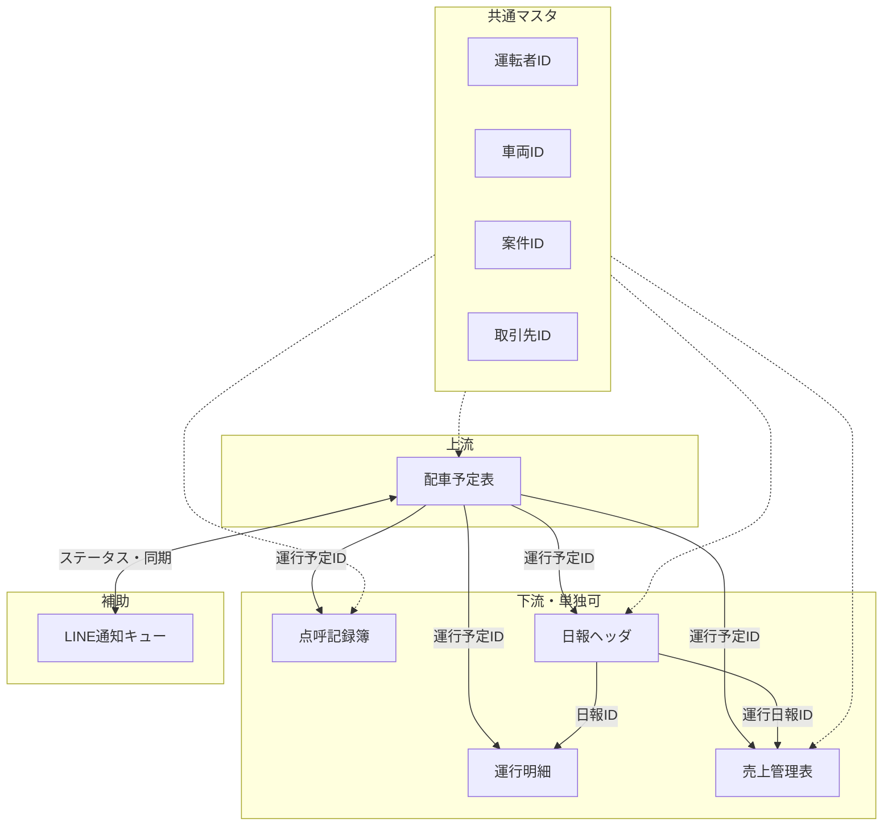

# 運行システム2 — システム全体設計

## 1. 結論（設計の要）

- **データの起点**は配車予定表。付与される **運行予定ID（内部Key: UNIQUEID）** を点呼・日報・売上と紐づける。**予定変更時は同一内部Keyを維持**し、**ステータス**と**更新日時**で管理する。
- **実体DB** は Google スプレッドシート。現場入力は **AppSheet**。**採番**は内部Keyを **UNIQUEID()** とし、人が読む **表示用番号** は別列（GAS／式で後から整備可）。
- **単独運用**：各サブシステム用シート／アプリだけでも業務が回る。**連携**：同一マスタIDと運行予定IDで結合可能。
- **補助機能**として **LINE通知**（キュー＋重複防止）を設計する。詳細は `line_notification_design.md`。
- **列仕様の正本**は `schema_master.md`。Google Drive 資料は参照のみ。

## 2. スコープ

| 名称 | 位置づけ |
|------|----------|
| 配車予定表 | 上流。予定の計画・割当。**ステータス**（予定／確定／変更／キャンセル）で変更・キャンセル・カレンダー同期・LINE制御 |
| 点呼記録簿 | 点呼タイミング・記録 |
| 運行日報 | 当日実績。**日報ヘッダ**（1日単位など）と **運行明細**（便・実出発／実到着・区間地表示）に分離 |
| 売上管理表 | 案件・運行に基づく売上（**運行日報ID** で計上根拠を辿れるようにする） |
| LINE通知（補助） | 翌日予定通知等、`schema_master.md` の LINE通知キューで管理 |

Google Drive にある Excel／PDF／雛形は **参照・移行元** とし、論理モデルは本ドキュメントとスキーママスタで管理する。

## 3. データ連携モデル（概念）

## 4. 共通IDの役割

| ID | 用途 |
|----|------|
| **運行予定ID** | 1件の「予定された運行」の内部Key（UNIQUEID）。横断結合の主軸。**変更しても同一Key維持（原則）**。 |
| **運行予定番号等** | 表示用。**帳票・人間向け**。 `schema_master.md` の「ID・採番ルール」参照。 |
| **運転者ID** | 運転者マスタの Key。 |
| **車両ID** | 車両マスタの Key。 |
| **案件ID** | 案件マスタの Key。 |
| **取引先ID** | 取引先マスタの Key。 |

## 5. Google Drive 資料との関係

- Drive 上のファイルは「現場で使っている物」「入力雛形」「集計」の**参考資料**として登録する（一覧は `source_materials.md`）。
- **設計・列の決定権**は **`schema_master.md`** および **`docs/`** におく。

## 6. 今後の拡張ポイント

- GAS と AppSheet の責務分割（送信・同期・表示用番号採番）。
- LINE 公式／LINE WORKS の選定。
- 権限・監査ログの要否。

詳細は各サブ設計書に委ねる。
