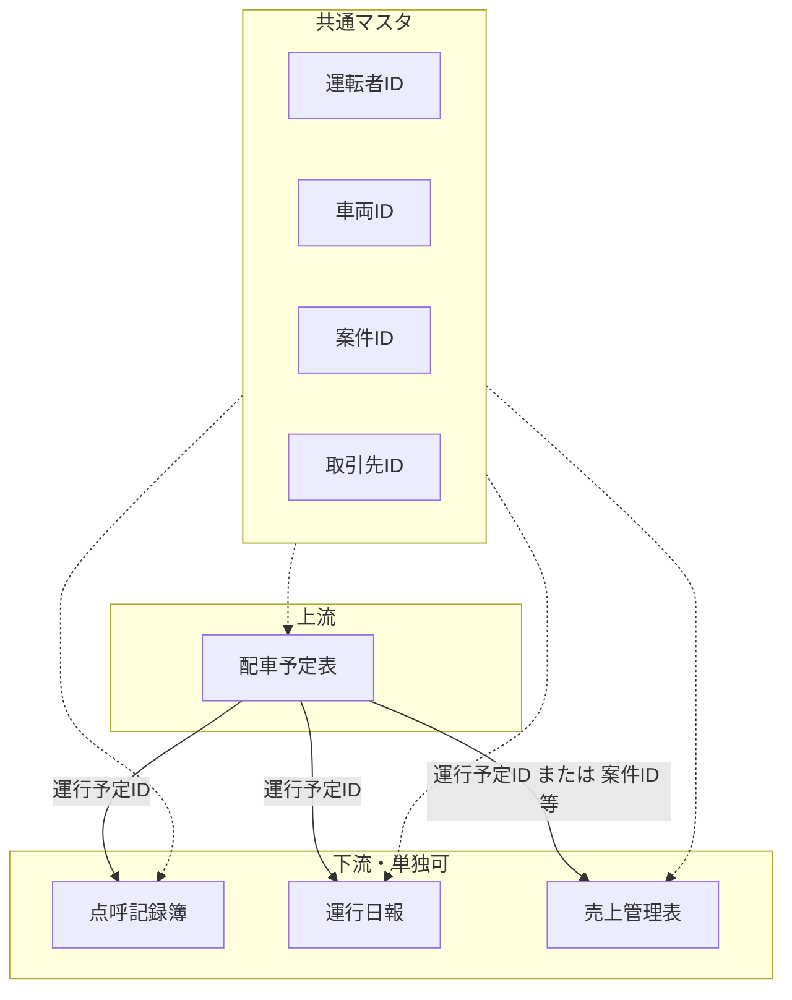

# 運行システム2 — システム全体設計

## 1. 結論（設計の要）

- **データの起点**は配車予定表。ここで付与または確定される **運行予定ID** を、点呼・日報・売上の各データと紐づける。
- **実体DB** は Google スプレッドシート。現場入力は **AppSheet**。
- **単独運用**：各サブシステム用シート／アプリだけでも業務が回る構成にする。**連携**：同一のマスタID（運転者・車両・案件・取引先）と運行予定IDで結合・照会可能にする。
- **列仕様の正本**は `schema_master.md`。実装との差異が出ないよう、このリポジトリを優先する。

## 2. スコープ

| 名称 | 位置づけ |
|------|----------|
| 配車予定表 | 上流。予定の計画・割当 |
| 点呼記録簿 | 点呼タイミング・記録 |
| 運行日報 | 当日運行の実績・記録 |
| 売上管理表 | 案件・運行に基づく売上情報 |

Google Drive にある Excel／PDF／雛形は **参照・移行元** とし、運用中の論理モデルは本ドキュメントとスキーママスタで管理する。

## 3. データ連携モデル（概念）

## 4. 共通IDの役割

| ID | 用途 |
|----|------|
| **運行予定ID** | 1件の「予定された運行」を横断的に指す。配車起点。 |
| **運転者ID** | 運転者マスタの正規キー。 |
| **車両ID** | 車両マスタの正規キー。 |
| **案件ID** | 請求・売上単位となる案件の正規キー。 |
| **取引先ID** | 荷主／取引先の正規キー。 |

各サブシートは、業務単独運用時はこれらが空または手入力でもよいが、連携運用時は **同一マスタ由来の値** を格納する。

## 5. Google Drive 資料との関係

- Drive 上のファイルは「現場で使っている物」「入力雛形」「集計」の**資料**として登録する（一覧は `source_materials.md`）。
- スキーマ変更の決定権は **`schema_master.md` + PR／レビュー** におく。

## 6. 今後の拡張ポイント

- AppSheet と GAS の責務分割（トリガ・集計・ID採番の所在）。
- 運行予定IDの採番規則（プレフィックス、日付連番など）。
- 権限・監査ログの要否。

詳細は各サブ設計書に委ねる。
